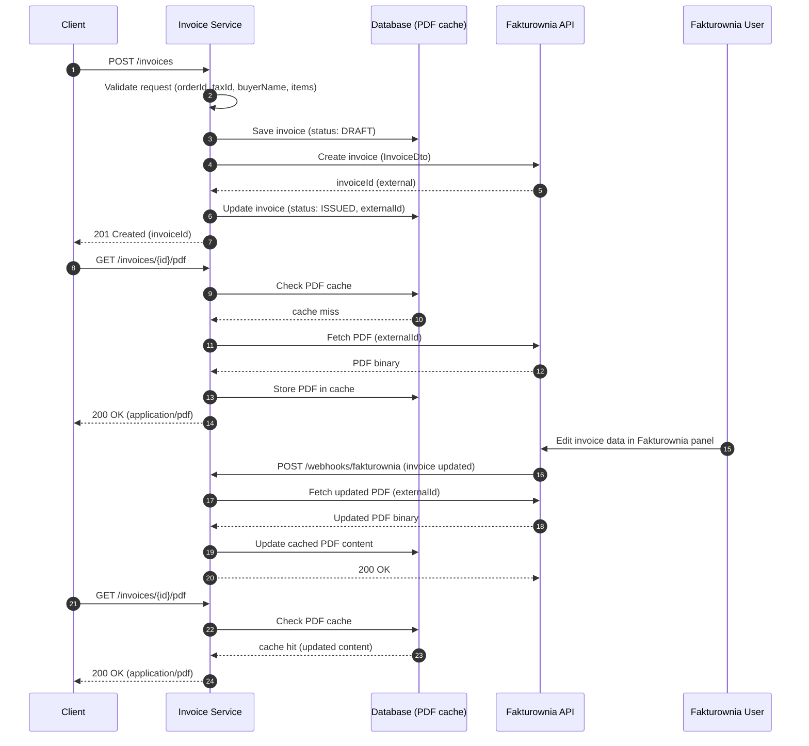
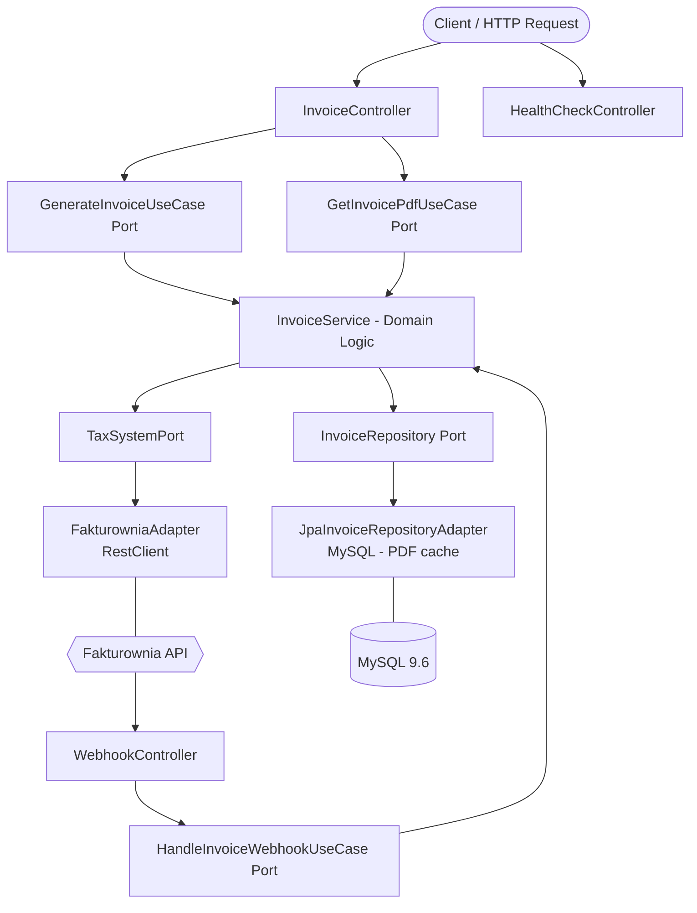

# 🧾 Invoice Service — Fakturownia Integration Platform

[](https://spring.io/projects/spring-boot)
[](https://openjdk.org/)
[](https://www.docker.com/)
[](https://opensource.org/licenses/MIT)

<a id="toc"></a>
## 📚 Table of Contents

- [📖 Overview](#overview)
- [🔄 How It Works (End-to-End Invoice Flow)](#how-it-works)
- [🌐 API Endpoints (Quick Reference)](#api-endpoints)
- [🚀 Getting Started (Local Environment)](#getting-started)
  - [ Swagger UI (Local OpenAPI Preview)](#swagger-ui-local)
- [⚙️ Environment Variables](#environment-variables)
- [🛠️ Common Issues / Troubleshooting](#common-issues)
- [🏗️ Architecture](#architecture)
- [✨ Technical Highlights & Engineering Decisions](#technical-highlights)
- [💻 Tech Stack](#tech-stack)
- [🧪 Testing Strategy & Quality Assurance](#testing-strategy)
- [📊 Observability](#observability)
- [📂 Repository Structure](#repository-structure)
- [🔮 Future Roadmap (Architectural Evolution)](#future-roadmap)
- [🤝 Contact](#contact)

<a id="overview"></a>
## 📖 Overview

[Back to Table of Contents](#toc)

Invoice Service is a production-ready microservice responsible for invoice lifecycle management, integrated with the [Fakturownia](https://fakturownia.pl) external invoicing API. The service handles invoice generation, PDF retrieval, and incoming webhook processing — all exposed via a clean REST API with built-in Swagger UI documentation.

This repository serves as a showcase of modern backend engineering practices (as of 2026), demonstrating clean **Hexagonal Architecture (Ports & Adapters)**, Java Virtual Threads (Project Loom), and a fully containerized development environment ready for seamless deployment.

<a id="how-it-works"></a>
## 🔄 How It Works (End-to-End Invoice Flow)

[Back to Table of Contents](#toc)

This is the complete invoice lifecycle from API request to PDF retrieval and status synchronization via webhooks:

### Interaction sequence



1. **Invoice creation (`POST /invoices`)**  
   The client sends invoice data (orderId, taxId, buyerName, line items). The application validates the request and persists a new invoice with `DRAFT` status.

2. **External invoice registration in Fakturownia**  
   The service calls the Fakturownia API to create the invoice document. On success, the local record is updated with the external invoice ID and its status changes to `ISSUED`.

3. **PDF retrieval — cache miss (`GET /invoices/{id}/pdf`)**  
   The client requests the invoice PDF. The service first checks the local database for a cached copy. On a cache miss, it fetches the PDF binary from Fakturownia, stores it in the database, and returns it to the client.

4. **Invoice edited in Fakturownia panel**  
   A user edits the invoice directly in the Fakturownia UI (e.g. corrects buyer data, updates line items). Fakturownia fires a webhook to the configured callback URL in our service.

5. **Webhook callback (`POST /webhooks/fakturownia`)**  
   The service receives the webhook from Fakturownia, then immediately calls the Fakturownia API to fetch the updated PDF binary. The fresh PDF is then written to the local database cache, overwriting the previous version.

6. **PDF retrieval — cache hit (`GET /invoices/{id}/pdf`)**  
   Any subsequent PDF request is served directly from the database cache, now containing the up-to-date content. No Fakturownia call is needed.

7. **Idempotency guard**  
   `InvoiceAlreadyExistsException` prevents duplicate invoice creation for the same `orderId`, returning `409 Conflict` on repeated requests.

8. **Concurrency safety**  
   `InvoiceConcurrentModificationException` guards against race conditions on concurrent invoice state updates.

<a id="api-endpoints"></a>
## 🌐 API Endpoints (Quick Reference)

[Back to Table of Contents](#toc)

Base URL (local): `http://localhost:8082`

| Method | Path | Purpose | Request | Success | Common errors |
|---|---|---|---|---|---|
| `GET` | `/health` | Service health check | none | `200 OK` | - |
| `POST` | `/invoices` | Generate a new invoice | JSON: `orderId`, `taxId`, `buyerName`, `items[]` | `201 Created` (`invoiceId`) | `400` (validation), `409` (invoice exists), `500` (Fakturownia error) |
| `GET` | `/invoices/{id}/pdf` | Download invoice PDF | path param: `id` (UUID) | `200 OK` (`application/pdf`) | `404` (not found), `500` (empty PDF / Fakturownia error) |
| `POST` | `/webhooks/fakturownia` | Handle Fakturownia status webhook | JSON webhook payload | `200 OK` | `400` (bad payload), `500` (internal error) |

### cURL examples

Create invoice:

```bash
curl -X POST "http://localhost:8082/invoices" \
  -H "Content-Type: application/json" \
  -d '{
    "orderId": "11111111-1111-1111-1111-111111111111",
    "taxId": "123-456-78-90",
    "buyerName": "John Doe",
    "items": [
      { "name": "Product A", "quantity": 2, "price": 99.99 },
      { "name": "Product B", "quantity": 1, "price": 49.99 }
    ]
  }'
```

Download invoice PDF:

```bash
curl -X GET "http://localhost:8082/invoices/3fa85f64-5717-4562-b3fc-2c963f66afa6/pdf" \
  --output invoice.pdf
```

Health check:

```bash
curl "http://localhost:8082/health"
```

<a id="getting-started"></a>
## 🚀 Getting Started (Local Environment)

[Back to Table of Contents](#toc)

### Prerequisites
* Docker & Docker Compose v2+
* Java 25+ (if running outside containers)
* Maven 3.9+ (if running outside containers)

### 1. Environment Configuration

```bash
cp .env.example .env
```

Fill in all required variables (Fakturownia credentials, database passwords). See [⚙️ Environment Variables](#environment-variables) for a full reference.

> The `.env` file is excluded from version control. The `.env.example` serves as a safe schema for collaborators.

### 2. Bootstrapping the Infrastructure

Spin up the database and service with a single command:

```bash
docker-compose up -d --build
```

MySQL readiness is health-checked before the application container starts — no manual sequencing needed.

### 3. Verification

* Invoice Service API: `http://localhost:8082`
* Health Check: `http://localhost:8082/actuator/health`
* MySQL: `localhost:3309` (via configured port)

<a id="swagger-ui-local"></a>
### 4. Swagger UI (Local OpenAPI Preview)

The repository includes `openapi.template.yaml`. The Swagger UI container renders a runtime `openapi.yaml` from this template using values from `.env`.

```bash
docker compose --profile docs up -d --build
```

Then open:

* `http://localhost:{SWAGGER_UI_PORT}` to access the interactive API documentation

> Note: `SWAGGER_UI_PORT` from `.env` is passed to the Swagger container and injected into `servers[0].url` at runtime.

<a id="environment-variables"></a>
## ⚙️ Environment Variables

[Back to Table of Contents](#toc)

The project reads values from `.env` (used by Docker Compose). Below is a full reference for every variable.

### MySQL

| Variable | Required | Description | Example |
|---|---|---|---|
| `INVOICE_SERVICE_MYSQL_DB_HOST` | yes | Hostname of the MySQL container (Docker internal network name) | `invoice-mysql` |
| `INVOICE_SERVICE_MYSQL_DB_PORT` | yes | Host port mapped to MySQL's internal `3306` | `3309` |
| `INVOICE_SERVICE_MYSQL_DB_NAME` | yes | Database/schema name created on startup | `invoices_db` |
| `INVOICE_SERVICE_MYSQL_DB_USER` | yes | Application database user (non-root) | `invoice_user` |
| `INVOICE_SERVICE_MYSQL_DB_PASSWORD` | yes | Password for the application user | `strongpassword` |
| `INVOICE_SERVICE_MYSQL_DB_ROOT_PASSWORD` | yes | MySQL root password used during container initialization | `rootpassword` |
| `INVOICE_SERVICE_MYSQL_INNODB_BUFFER_POOL_SIZE` | optional | InnoDB buffer pool size — tune based on available memory | `256M` |
| `INVOICE_SERVICE_MYSQL_MAX_CONNECTIONS` | optional | Maximum number of concurrent MySQL connections | `200` |

### Application

| Variable | Required | Description | Example |
|---|---|---|---|
| `INVOICE_SERVICE_PORT` | yes | HTTP port exposed by the service container | `8082` |
| `INVOICE_SERVICE_APPLICATION_NAME` | optional | Value of `spring.application.name` (used in logs/metadata) | `invoice-service` |
| `INVOICE_SERVICE_FAKTUROWNIA_URL` | yes | Base URL of your Fakturownia account | `https://yourcompany.fakturownia.pl` |
| `INVOICE_SERVICE_FAKTUROWNIA_TOKEN` | yes | API token for authenticating with the Fakturownia API | `your_api_token` |
| `SWAGGER_UI_PORT` | optional | Host port for the Swagger UI container (activated with `--profile docs`) | `9000` |

### What is `INVOICE_SERVICE_FAKTUROWNIA_TOKEN`?

- It is the **API token** issued by your Fakturownia account, used to authenticate all outbound calls (invoice creation, PDF fetching).
- Where to find it: in your Fakturownia account settings under **Integrations / API**.
- If this value is wrong or missing, all Fakturownia API calls will fail with authentication errors.

### Required vs optional (quick summary)

- **Required in practice:** `INVOICE_SERVICE_FAKTUROWNIA_URL`, `INVOICE_SERVICE_FAKTUROWNIA_TOKEN`, all DB credentials, `INVOICE_SERVICE_PORT`.
- **Optional/tunable:** `INVOICE_SERVICE_APPLICATION_NAME`, `INVOICE_SERVICE_MYSQL_INNODB_BUFFER_POOL_SIZE`, `INVOICE_SERVICE_MYSQL_MAX_CONNECTIONS`, `SWAGGER_UI_PORT`.

<a id="common-issues"></a>
## 🛠️ Common Issues / Troubleshooting

[Back to Table of Contents](#toc)

### 1) Docker does not start

- **Symptoms:** `docker-compose up` fails, containers exit immediately, or build hangs.
- **Most common causes:** Port conflict, stale containers/images, invalid `.env` values.
- **What to do:**

```bash
docker compose ps
docker compose config
docker compose down
docker compose up -d --build
```

If ports are already in use, change host ports in `.env` (e.g. `INVOICE_SERVICE_MYSQL_DB_PORT` or `INVOICE_SERVICE_PORT`).

### 2) Database is not ready

- **Symptoms:** App logs show DB connection errors at startup (`Communications link failure`, `Connection refused`).
- **Most common cause:** MySQL container is still booting while the app tries to connect.
- **What to do:**

```bash
docker compose ps
docker compose logs invoice-mysql --tail 200
docker compose logs invoice-service --tail 200
```

Verify `INVOICE_SERVICE_MYSQL_*` values in `.env` (host, port, db name, user, password). The healthcheck will prevent the app from starting until MySQL is ready — if it still fails, check that `INVOICE_SERVICE_MYSQL_DB_HOST` matches the Docker Compose service name (`invoice-mysql`).

### 3) Fakturownia returns 401 (Unauthorized)

- **Symptoms:** Invoice creation fails with HTTP `401` from the Fakturownia API.
- **Most common causes:** Wrong or expired `INVOICE_SERVICE_FAKTUROWNIA_TOKEN`, incorrect `INVOICE_SERVICE_FAKTUROWNIA_URL`.
- **What to do:**

1. Validate `INVOICE_SERVICE_FAKTUROWNIA_TOKEN` in your Fakturownia account settings.
2. Ensure `INVOICE_SERVICE_FAKTUROWNIA_URL` matches your account subdomain (e.g. `https://yourcompany.fakturownia.pl`).
3. Restart the service after `.env` changes.

```bash
docker compose up -d --build
docker compose logs invoice-service --tail 200
```

### 4) PDF download returns empty response

- **Symptoms:** `GET /invoices/{id}/pdf` fails with `500` or returns an empty body.
- **Most common cause:** The invoice was not successfully issued in Fakturownia (status not `ISSUED`), or Fakturownia did not generate a PDF yet.
- **What to do:** Check the invoice status via the database or logs. Ensure the invoice creation (`POST /invoices`) completed without errors before attempting PDF download.

<a id="architecture"></a>
## 🏗️ Architecture

[Back to Table of Contents](#toc)

The system follows a **Hexagonal Architecture (Ports & Adapters)** approach, strictly separating domain logic from infrastructure concerns. All external dependencies — MySQL persistence and Fakturownia API — are injected through explicit output ports, making the core fully testable without any infrastructure.



<a id="technical-highlights"></a>
## ✨ Technical Highlights & Engineering Decisions

[Back to Table of Contents](#toc)

* **Hexagonal Architecture (Ports & Adapters):** Strict boundary between domain, application, and infrastructure layers. The domain model (`Invoice`, `InvoiceItem`, `InvoiceStatus`) is completely isolated — all external dependencies are injected through explicit output ports (`TaxSystemPort`, `InvoiceRepository`), enabling independent testability and easy adapter swapping.
* **Java Virtual Threads (Project Loom):** `spring.threads.virtual.enabled: true` is enabled application-wide, giving each incoming request a cheap virtual thread instead of a pooled OS thread — maximising throughput during I/O-heavy Fakturownia API calls without any reactive programming complexity.
* **Optimistic Concurrency Control:** `InvoiceConcurrentModificationException` guards against race conditions on concurrent invoice state updates at the domain level.
* **Webhook Support:** A dedicated `WebhookController` + `HandleInvoiceWebhookUseCase` cleanly handles status-change callbacks pushed by Fakturownia, keeping invoice state in sync without polling.
* **HikariCP Tuning:** Connection pool explicitly configured (`maximum-pool-size: 20`, `connection-timeout: 2000ms`, `keepalive-time: 30s`, `max-lifetime: 30min`) for predictable behaviour under production load.
* **Swagger UI as a Separate Container:** API documentation is served by a standalone `swaggerapi/swagger-ui` container activated via the `docs` Docker Compose profile — keeping the main service image clean and documentation deployment optional.
* **Optimised Multi-Stage Docker Build:** Two-stage Dockerfile — Maven compiles and packages on `eclipse-temurin-25-alpine`, then only the extracted layered JARs are copied into a minimal JRE runtime image. The app runs as a non-root user (`appuser`) with JVM flags tuned for containers (`-XX:+UseContainerSupport`, `-XX:MaxRAMPercentage=75.0`, G1GC) and a built-in Actuator healthcheck.
* **Structured Logging:** All containers use the `json-file` driver with rolling log files (`max-size: 50m`, `max-file: 3`), preventing unbounded disk usage in production.

<a id="tech-stack"></a>
## 💻 Tech Stack

[Back to Table of Contents](#toc)

| Layer | Technology |
|---|---|
| **Language** | Java 25 (Virtual Threads enabled) |
| **Framework** | Spring Boot 4.0.5, Spring Data JPA, Spring WebMVC, Spring Validation |
| **Database** | MySQL 9.6.0 (HikariCP connection pool) |
| **External API** | Fakturownia (via Spring RestClient) |
| **Architecture** | Hexagonal / Ports & Adapters |
| **Observability** | Spring Boot Actuator |
| **API Docs** | Swagger UI (Docker, `docs` profile) |
| **Containerization** | Docker (multi-stage build), Docker Compose |
| **Other** | Lombok |

<a id="testing-strategy"></a>
## 🧪 Testing Strategy & Quality Assurance

[Back to Table of Contents](#toc)

### How to run tests

```bash
mvn test
```

<a id="observability"></a>
## 📊 Observability

[Back to Table of Contents](#toc)

The service exposes health and readiness endpoints via **Spring Boot Actuator**:

* **Health Endpoint:** `GET /actuator/health` — used by Docker healthcheck (`wget -qO- http://localhost:8082/actuator/health`) and orchestrators for readiness probing.
* **Custom Health Check:** `GET /health` — application-level health check controller returning service status.
* **JVM Tuning:** Container-aware JVM settings (`-XX:+UseContainerSupport`, `-XX:MaxRAMPercentage=75.0`, G1GC) ensure stable memory behaviour under constrained Docker resources.

<a id="repository-structure"></a>
## 📂 Repository Structure

[Back to Table of Contents](#toc)

```text
.
├── src/
│   ├── main/
│   │   ├── java/com/rzodeczko/
│   │   │   ├── application/
│   │   │   │   ├── port/input/           # Inbound ports (use case interfaces + commands)
│   │   │   │   ├── port/output/          # Outbound ports (TaxSystemPort)
│   │   │   │   └── service/              # Application service (InvoiceService)
│   │   │   ├── domain/
│   │   │   │   ├── exception/            # Domain exceptions
│   │   │   │   ├── model/                # Domain models (Invoice, InvoiceItem, InvoiceStatus)
│   │   │   │   └── repository/           # Repository interface (InvoiceRepository)
│   │   │   ├── infrastructure/
│   │   │   │   ├── configuration/        # Spring beans, Fakturownia & Swagger CORS properties
│   │   │   │   ├── fakturownia/          # FakturowniaAdapter + DTOs (RestClient integration)
│   │   │   │   ├── persistence/          # JPA entities, mapper, repository adapter
│   │   │   │   ├── transaction/          # Transaction boundary
│   │   │   │   └── usecase/              # Use case implementations
│   │   │   └── presentation/
│   │   │       ├── controller/           # REST controllers (Invoice, Webhook, HealthCheck)
│   │   │       ├── dto/                  # Request/Response DTOs
│   │   │       └── exception/            # Global exception handler
│   │   └── resources/
│   │       └── application.yaml          # Server, datasource, HikariCP, virtual threads config
│   └── test/                             # JPA & controller slice tests
├── docker-compose.yaml                   # MySQL + application + Swagger UI orchestration
├── Dockerfile                            # Multi-stage build (Maven build → minimal JRE runtime)
├── openapi.template.yaml                 # OpenAPI spec template (injected into Swagger UI container)
├── .env.example                          # Environment variables template
└── pom.xml
```

<a id="future-roadmap"></a>
## 🔮 Future Roadmap (Architectural Evolution)

[Back to Table of Contents](#toc)

Planned iterations for system evolution include:

* **Testcontainers:** Ephemeral MySQL instances in integration tests via [Testcontainers](https://testcontainers.com/) — fully isolated, reproducible runs without external DB dependencies.
* **Resilience4j:** Retry + Circuit Breaker on Fakturownia RestClient calls to handle transient API unavailability gracefully.
* **CI/CD Pipeline:** GitHub Actions workflow automating build → test → Docker image push with JaCoCo coverage gate.
* **Distributed Tracing:** OpenTelemetry integration with Tempo/Jaeger for end-to-end request visibility.

<a id="contact"></a>
## 🤝 Contact

[Back to Table of Contents](#toc)

Designed and implemented by **Michał Rzodeczko**.
Feel free to check out my other projects on [GitHub](https://github.com/CoderNoOne).
