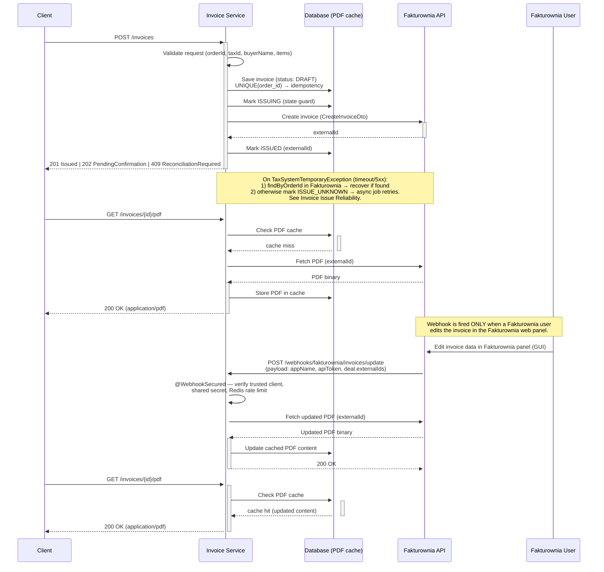
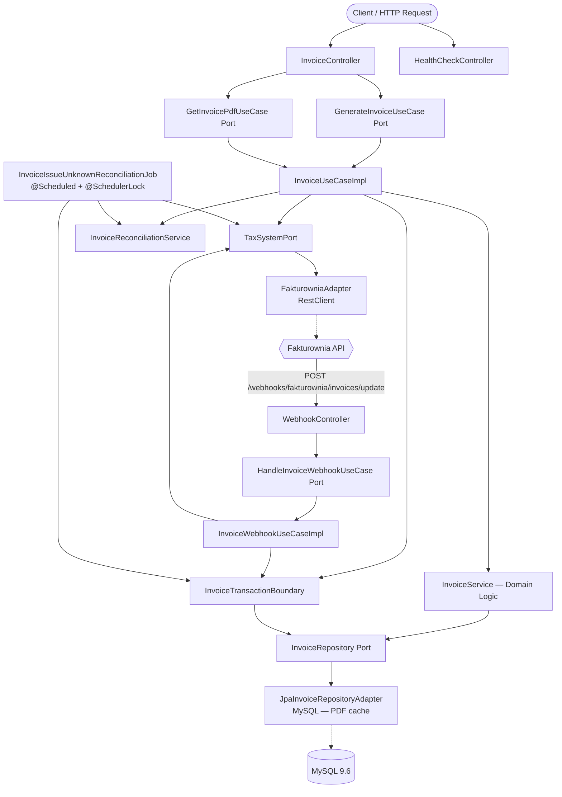
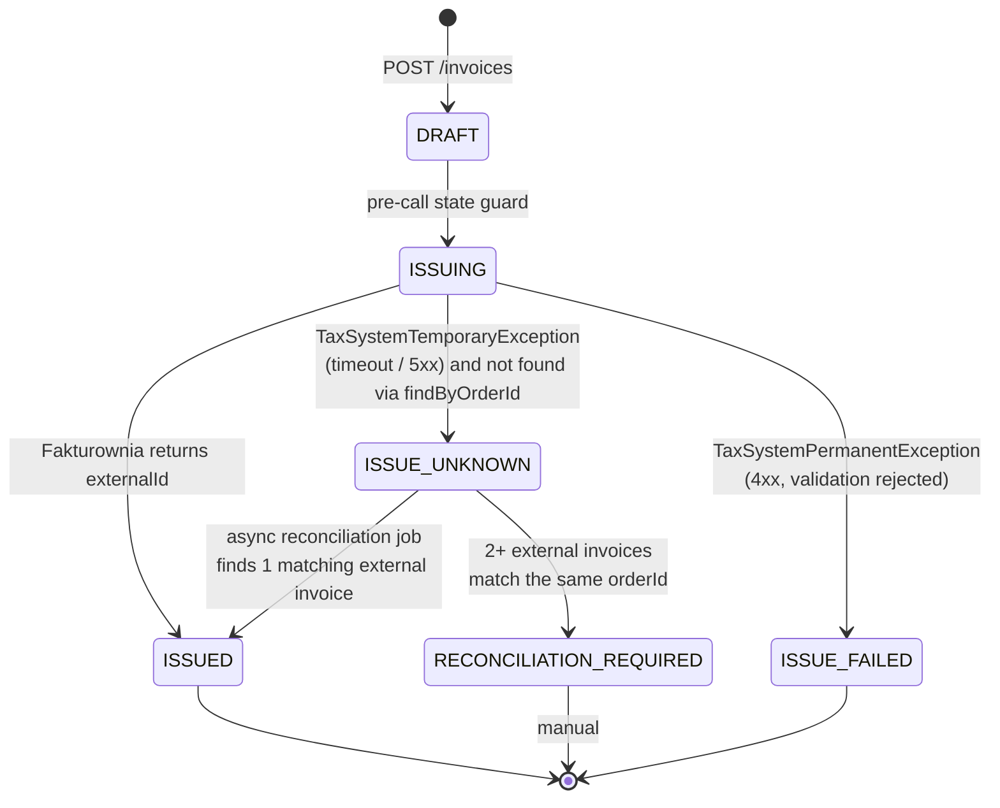

# Invoice Service – Fakturownia Integration Platform

[](https://spring.io/projects/spring-boot)
[](https://openjdk.org/)
[](https://www.docker.com/)
[](https://codecov.io/gh/mrzodeczko-dev/invoice-service)
[](https://opensource.org/licenses/MIT)

<a id="toc"></a>
## Table of Contents

- [Overview](#overview)
- [How It Works](#how-it-works)
- [API Endpoints](#api-endpoints)
- [Getting Started](#getting-started)
- [Environment Variables](#environment-variables)
- [Troubleshooting](#troubleshooting)
- [Architecture](#architecture)
- [Webhook Security](#webhook-security)
- [Invoice Issue Reliability](#invoice-issue-reliability)
- [Technical Highlights](#technical-highlights)
- [Tech Stack](#tech-stack)
- [Testing](#testing)
- [Observability](#observability)
- [Repository Structure](#repository-structure)
- [Roadmap](#roadmap)
- [Contact](#contact)

---

<a id="overview"></a>
## Overview

[↑ Back to top](#toc)

Invoice Service is a production-ready microservice responsible for invoice lifecycle management, integrated with the [Fakturownia](https://fakturownia.pl) external invoicing API. The service handles invoice generation, PDF retrieval, and incoming webhook processing — all exposed via a clean REST API with built-in Swagger UI documentation (via springdoc).

The project demonstrates modern backend engineering practices: **Hexagonal Architecture (Ports & Adapters)**, Java Virtual Threads (Project Loom), an explicit invoice state machine with reconciliation, AOP-based webhook authorization with distributed rate limiting, and a fully containerized development environment.

---

<a id="how-it-works"></a>
## How It Works

[↑ Back to top](#toc)

Complete invoice lifecycle from API request to PDF retrieval and cache invalidation via webhooks:



### Step-by-step

1. **Invoice creation (`POST /invoices`)** — the client sends invoice data. The application validates the request and persists a new invoice with `DRAFT` status. A `UNIQUE(order_id)` constraint guarantees idempotency at the DB level.
2. **External registration** — the service transitions the invoice to `ISSUING`, then calls Fakturownia. On success the local record moves to `ISSUED` with the external ID. Failure modes (timeout, 5xx, restart between steps) are handled by a reconciliation flow — see [Invoice Issue Reliability](#invoice-issue-reliability).
3. **PDF retrieval – cache miss (`GET /invoices/{id}/pdf`)** — on cache miss, the service fetches the PDF from Fakturownia, stores it in the database, and returns it to the client.
4. **Invoice edited in Fakturownia panel** — the webhook is triggered **only** when a Fakturownia user edits the invoice in the Fakturownia GUI. It is **not** fired by `POST /invoices` (own-API creation) or by any internal service action.
5. **Webhook callback (`POST /webhooks/fakturownia/invoices/update`)** — Fakturownia calls the endpoint, the request is gated by `@WebhookSecured` (see [Webhook Security](#webhook-security)), then the service fetches the updated PDF from Fakturownia and overwrites the local database cache.
6. **PDF retrieval – cache hit** — subsequent PDF requests are served directly from the database cache. No Fakturownia call needed.

---

<a id="api-endpoints"></a>
## API Endpoints

[↑ Back to top](#toc)

Base URL (local): `http://localhost:${INVOICE_SERVICE_PORT}` (default: `8082`)

| Method | Path | Description | Request body | Success | Error codes |
|--------|------|-------------|-------------|---------|-------------|
| `GET` | `/` | Service health check | — | `200 OK` | — |
| `POST` | `/invoices` | Create a new invoice | `orderId`, `taxId`, `buyerName`, `items[]` | `201 Issued` / `202 PendingConfirmation` / `409 ReconciliationRequired` | `400` (validation), `409` (concurrent modification), `422` (permanent tax-system error), `503` (temporary tax-system error), `500` |
| `GET` | `/invoices/{id}/pdf` | Download invoice PDF | — | `200 OK` (`application/pdf`) | `404` (invoice not found), `409` (not yet issued), `502` (empty PDF from Fakturownia), `503`, `500` |
| `POST` | `/webhooks/fakturownia/invoices/update` | Handle Fakturownia `invoice:update` webhook (fired by Fakturownia GUI edits only) | JSON webhook payload | `200 OK` | `400`, `401`, `429`, `500` |
| `GET` | `/actuator/health` | Spring Boot Actuator health (used by Docker healthcheck and orchestrators) | — | `200 OK` | — |

> **`POST /invoices` response model.** The endpoint returns a `CreateInvoiceResponseDto` (`invoiceId`, `status`, `message`) with the HTTP status reflecting which `InvoiceIssueResult` variant was produced. See [Invoice Issue Reliability → API response contract](#invoice-issue-reliability) for the exact semantics of each status.

### cURL examples

**Create invoice:**
```bash
curl -X POST "http://localhost:8082/invoices" \
  -H "Content-Type: application/json" \
  -d '{
    "orderId": "bad9c5b2-73a3-4cb2-96d2-8ae7c29d6297",
    "taxId": "123-456-78-90",
    "buyerName": "John Doe",
    "items": [
      { "name": "Product A", "quantity": 2, "price": 99.99, "taxRate": 0.23 },
      { "name": "Product B", "quantity": 1, "price": 49.99, "taxRate": 0.23 }
    ]
  }'
```

Example successful response (`201 Created`):
```json
{
  "invoiceId": "3fa85f64-5717-4562-b3fc-2c963f66afa6",
  "status": "ISSUED",
  "message": "Invoice issued"
}
```

**Download invoice PDF:**
```bash
curl -X GET "http://localhost:8082/invoices/3fa85f64-5717-4562-b3fc-2c963f66afa6/pdf" \
  --output invoice.pdf
```

**Health check:**
```bash
curl "http://localhost:8082/"
```

---

<a id="getting-started"></a>
## Getting Started

[↑ Back to top](#toc)

### Prerequisites

- Docker & Docker Compose v2
- Java 25+ _(only if running outside containers)_
- Maven 3.9+ _(only if running outside containers)_
- A reachable Redis instance — required by the webhook rate limiter (see [Webhook Security](#webhook-security)). Not bundled in `docker-compose.yaml`; configure `SPRING_DATA_REDIS_HOST` / `SPRING_DATA_REDIS_PORT` accordingly.

### 1. Environment configuration

```bash
cp .env.example .env
```

Fill in all required variables (Fakturownia credentials, database passwords, webhook shared secret). See [Environment Variables](#environment-variables) for a full reference.

> `.env` is excluded from version control. `.env.example` serves as a safe schema for collaborators.

### 2. Start the services

```bash
docker compose up -d --build
```

MySQL readiness is health-checked before the application container starts — no manual sequencing needed.

### 3. Verify

| Resource | URL |
|----------|-----|
| Invoice Service API | `http://localhost:${INVOICE_SERVICE_PORT}` |
| Health check | `http://localhost:${INVOICE_SERVICE_PORT}/` |
| Actuator health | `http://localhost:${INVOICE_SERVICE_PORT}/actuator/health` |
| MySQL | `localhost:${INVOICE_SERVICE_MYSQL_DB_PORT}` |

### 4. Swagger UI (optional)

The service uses **springdoc-openapi**, which generates the OpenAPI definition and Swagger UI directly from the running application. Enable it by setting:

```env
SPRINGDOC_API_DOCS_SWAGGER_ENABLED=true
```

in your `.env` and restarting the service. Swagger UI is then served at `http://localhost:${INVOICE_SERVICE_PORT}/swagger-ui/index.html` and the OpenAPI JSON at `/v3/api-docs`. It is **disabled by default** so production deployments do not leak API metadata.

---

<a id="environment-variables"></a>
## Environment Variables

[↑ Back to top](#toc)

All variables are read from `.env` (used by Docker Compose). Copy `.env.example` as a starting point.

### MySQL

| Variable | Required | Description | Default / Example |
|----------|----------|-------------|-------------------|
| `INVOICE_SERVICE_MYSQL_DB_HOST` | yes | MySQL container hostname (Docker internal network name) | `invoice-mysql` |
| `INVOICE_SERVICE_MYSQL_DB_PORT` | yes | Host port mapped to MySQL's internal `3306` | `3309` |
| `INVOICE_SERVICE_MYSQL_DB_NAME` | yes | Database/schema name created on startup | `invoices_db` |
| `INVOICE_SERVICE_MYSQL_DB_USER` | yes | Application database user (non-root) | — |
| `INVOICE_SERVICE_MYSQL_DB_PASSWORD` | yes | Password for the application user | — |
| `INVOICE_SERVICE_MYSQL_DB_ROOT_PASSWORD` | yes | MySQL root password used during container init | — |
| `INVOICE_SERVICE_MYSQL_INNODB_BUFFER_POOL_SIZE` | no | InnoDB buffer pool size | `256M` |
| `INVOICE_SERVICE_MYSQL_MAX_CONNECTIONS` | no | Maximum concurrent MySQL connections | `200` |

### Application

| Variable | Required | Description | Default / Example |
|----------|----------|-------------|-------------------|
| `INVOICE_SERVICE_PORT` | yes | HTTP port exposed by the service container | `8082` |
| `INVOICE_SERVICE_APPLICATION_NAME` | no | `spring.application.name` (used in logs/metadata) | `invoice-service` |
| `INVOICE_SERVICE_FAKTUROWNIA_URL` | yes | Base URL of your Fakturownia account | `https://yourcompany.fakturownia.pl` |
| `INVOICE_SERVICE_FAKTUROWNIA_TOKEN` | yes | API token for Fakturownia authentication | — |
| `INVOICE_SERVICE_WEBHOOK_TOKEN` | yes | Shared secret used by `@WebhookSecured` to authenticate Fakturownia webhook callbacks. Must match the token configured in the Fakturownia webhook integration panel. | — |
| `SPRINGDOC_API_DOCS_SWAGGER_ENABLED` | no | When `true`, enables the embedded Swagger UI at `/swagger-ui/index.html` | `false` |

### Redis (rate limiter — see [Webhook Security](#webhook-security))

| Variable | Required | Description | Default |
|----------|----------|-------------|---------|
| `SPRING_DATA_REDIS_HOST` | yes (when webhook traffic is expected) | Redis host used by Bucket4j to store per-client token buckets | `localhost` |
| `SPRING_DATA_REDIS_PORT` | yes (when webhook traffic is expected) | Redis port | `6379` |

> **Where to find `INVOICE_SERVICE_FAKTUROWNIA_TOKEN`:** in your Fakturownia account under _Settings → Integrations → API_. If this value is wrong or missing, all outbound Fakturownia calls will fail with `401 Unauthorized`.

---

<a id="troubleshooting"></a>
## Troubleshooting

[↑ Back to top](#toc)

| Problem | Likely cause | Fix |
|---------|-------------|-----|
| Containers won't start | Port conflict, stale images, invalid `.env` | `docker compose down && docker compose up -d --build`; change ports in `.env` if needed |
| DB connection errors at startup | MySQL still booting, wrong credentials | Check `INVOICE_SERVICE_MYSQL_DB_HOST` matches service name `invoice-mysql`; inspect logs with `docker compose logs invoice-mysql --tail 50` |
| Fakturownia `401 Unauthorized` (outbound) | Invalid or expired token / wrong URL | Re-check `INVOICE_SERVICE_FAKTUROWNIA_TOKEN` and `INVOICE_SERVICE_FAKTUROWNIA_URL` in `.env`, then restart |
| Webhook returns `401 Unauthorized` | Shared secret mismatch, unknown `appName`, or client disabled | Re-check `INVOICE_SERVICE_WEBHOOK_TOKEN` against the value in the Fakturownia webhook panel; verify `webhook.clients.fakturownia.enabled: true` |
| Webhook returns `429 Too Many Requests` | Per-minute rate limit exceeded | Lower request volume from Fakturownia or raise `webhook.clients.fakturownia.requests-per-minute-limit` |
| Webhook calls hang / Redis errors at startup | Redis unreachable (rate limiter cannot initialize buckets) | Provide a reachable Redis via `SPRING_DATA_REDIS_HOST` / `SPRING_DATA_REDIS_PORT`; Redis is **not** bundled in `docker-compose.yaml` |
| Reconciliation job not running | `@EnableScheduling` missing or job disabled | Ensure `ShedLockConfig` (which carries `@EnableScheduling`) is loaded; confirm `reconciliation.jobs.unknown-invoice-recovery.enabled: true` |
| PDF returns `409 InvoiceNotIssued` | Invoice still in `DRAFT` / `ISSUING` / `ISSUE_UNKNOWN` | Confirm `POST /invoices` returned `201 ISSUED`; if `202 PENDING_CONFIRMATION`, wait for the async reconciliation job |

---

<a id="architecture"></a>
## Architecture

[↑ Back to top](#toc)

The service follows **Hexagonal Architecture (Ports & Adapters)**, strictly separating domain logic from infrastructure concerns. All external dependencies (MySQL persistence, Fakturownia API) are injected through explicit output ports, making the core fully testable without any infrastructure.



> **Webhook flow note:** the webhook path intentionally bypasses `InvoiceService`. `InvoiceWebhookUseCaseImpl` orchestrates the cache refresh through `InvoiceTransactionBoundary` (transactional access to the invoice and PDF cache via `InvoiceRepository`) and `TaxSystemPort` (PDF re-fetch from Fakturownia). No domain state transition occurs here — only the cached PDF binary is replaced — so going through the application service would add no value.

> **When is the webhook triggered?** Only when a Fakturownia user edits an invoice in the Fakturownia web panel (GUI). Calls to our own `POST /invoices` endpoint do not trigger this webhook — the local DB record is updated synchronously inside that request.

> **Reconciliation paths.** `InvoiceReconciliationService` is reused by both the synchronous create flow (in `InvoiceUseCaseImpl`) and the asynchronous `@Scheduled` job — same matching logic, same idempotency guarantees, single source of truth.

---

<a id="webhook-security"></a>
## Webhook Security

[↑ Back to top](#toc)

The webhook endpoint `POST /webhooks/fakturownia/invoices/update` is internet-facing and is protected by a custom AOP-based authorization layer triggered by the `@WebhookSecured` annotation on the controller method. **Note:** Fakturownia does not sign webhook payloads (no HMAC), so this service relies on a shared-secret model verified against the request body, combined with a per-client rate limit.

### What `@WebhookSecured` does

```java
@PostMapping("/fakturownia/invoices/update")
@WebhookSecured(value = TrustedWebhookClient.FAKTUROWNIA)
public ResponseEntity<Void> handleInvoiceUpdated(@RequestBody FakturowniaWebhookDto payload) { ... }
```

When a request hits a method annotated with `@WebhookSecured`, `WebhookSecurityAspect` (a Spring AOP `@Before` advice) executes the following checks **before** the controller body runs:

| Step | Check | On failure |
|------|-------|-----------|
| 1 | **Trusted client whitelist** — the `appName` field in the payload must map to a `TrustedWebhookClient` enum value (`FAKTUROWNIA`) that is also listed in the annotation's `value`. | `401 Unauthorized` (`UnauthorizedWebhookAccessException`) |
| 2 | **Client enabled flag** — the matching client config in `WebhookClientsProperties` must have `enabled: true`. Lets us kill-switch a compromised client without redeploy. | `401 Unauthorized` |
| 3 | **Shared secret match** — the `apiToken` field in the payload is compared to the configured `sharedSecret` using `MessageDigest.isEqual` (constant-time, timing-attack resistant). | `401 Unauthorized` |
| 4 | **Per-client rate limit** — a Bucket4j token bucket keyed by `webhook:ratelimit:{appName}` is consumed in **Redis** (greedy refill, `requestsPerMinuteLimit` per client). | `429 Too Many Requests` (`Retry-After` hint in message) |

Only if all four checks pass is the controller invoked.

### Why Redis-backed rate limiting

Bucket4j buckets are stored in Redis via `LettuceBasedProxyManager`, so the limit is **shared across all replicas** of the service. Scaling horizontally does not multiply the effective rate limit — a single Fakturownia client is throttled globally regardless of which pod handles the request. Bucket TTL is bound to refill time (1 min), so abandoned clients do not pollute Redis indefinitely.

> **Redis is not bundled in `docker-compose.yaml`.** Provide a reachable Redis instance via `SPRING_DATA_REDIS_HOST` / `SPRING_DATA_REDIS_PORT`. The application starts without Redis but webhook calls will fail when the rate limiter tries to talk to it.

### Trade-offs and known limitations

- **No HMAC signature.** Fakturownia does not provide one. The shared secret is transmitted in the request body (`apiToken` field), which means request integrity depends on TLS — **the endpoint must be exposed only over HTTPS**.
- **No IP allowlist.** Fakturownia does not publish a stable webhook egress IP range, so allowlisting is not applied. If your deployment can place a CDN/WAF (e.g. Cloudflare) in front of the service, scoping the route to known Fakturownia ranges would be a reasonable defence-in-depth.
- **Replay protection is not implemented.** A captured payload (e.g. via a logging breach) could be replayed within rate-limit budget. Mitigations to consider: persisting recently seen webhook IDs (`payload.id`) for a short TTL and rejecting duplicates, or rotating `sharedSecret` on suspected compromise.
- **Secret rotation is manual** — update `INVOICE_SERVICE_WEBHOOK_TOKEN` in the application configuration and the corresponding value in the Fakturownia panel. The `enabled: false` flag can be flipped first to fail-closed during the rotation window.

### Configuration

Client configuration lives under `webhook.clients.<appName>` in `application.yaml` (loaded into `WebhookClientsProperties`):

```yaml
webhook:
  clients:
    fakturownia:
      enabled: true                                       # set to false to kill-switch this client without redeploy
      shared-secret: ${INVOICE_SERVICE_WEBHOOK_TOKEN:secret}
      requests-per-minute-limit: 60                        # set to 0 to disable rate limiting for this client
```

Set `requests-per-minute-limit: 0` (or omit the property) to disable rate limiting for that client.

---

<a id="invoice-issue-reliability"></a>
## Invoice Issue Reliability

[↑ Back to top](#toc)

### Problem

Issuing an invoice spans **two systems** — the local MySQL database and the Fakturownia API. The naive sequence (`save DRAFT → call Fakturownia → mark ISSUED`) has a known failure window: if the Fakturownia call succeeds but the final `markInvoiceAsIssued` step fails (DB outage, network timeout on the response, JVM restart), Fakturownia ends up holding an invoice that the local DB doesn't know about. On the next client retry of `POST /invoices` (same `orderId`), a duplicate would be created in Fakturownia.

This service explicitly addresses that gap rather than ignoring it.

### Invoice state machine



| Status | Meaning |
|--------|---------|
| `DRAFT` | Local record persisted; Fakturownia not yet called. |
| `ISSUING` | Pre-call state guard — Fakturownia call is in flight. Used to detect interrupted flows on restart. |
| `ISSUED` | Confirmed in Fakturownia, `externalId` is stored locally. Terminal happy path. |
| `ISSUE_UNKNOWN` | Fakturownia call failed with a temporary error and no matching invoice was found via `findByOrderId`. Eligible for the async reconciliation job. |
| `ISSUE_FAILED` | Fakturownia rejected the request permanently (4xx, validation). Terminal failure. |
| `RECONCILIATION_REQUIRED` | Two or more Fakturownia invoices match the same local `orderId`. Manual intervention required — the service refuses to guess which one to bind. |

### Recovery strategy

The controlling logic lives in `InvoiceUseCaseImpl.tryIssueAndRecover` and `InvoiceReconciliationService`. The strategy combines four mechanisms:

1. **DB-level idempotency.** `UNIQUE(order_id)` on the `invoices` table makes a duplicate `POST /invoices` for the same `orderId` impossible at the storage layer. On constraint violation the service loads the existing record and resumes its current state (`isIssued()` → return `Issued`, `isIssueUnknown()` → return `PendingConfirmation`, etc.) instead of creating a second one.
2. **Pre-call lookup (recover-before-issue).** Before sending `issueInvoice`, the use case calls `taxSystemPort.findByOrderId(orderId)`. If Fakturownia already has an invoice for that `orderId` (a survivor of a previous failed attempt), the local record is bound to the existing `externalId` instead of issuing a duplicate.
3. **Synchronous post-failure recovery.** A `TaxSystemTemporaryException` (timeout, connection error, 5xx) does not propagate immediately — the use case retries the `findByOrderId` lookup. If Fakturownia did receive the create but the response was lost, the invoice is recovered and marked `ISSUED` in the same request.
4. **Asynchronous reconciliation job.** If `findByOrderId` still returns nothing after a temporary failure, the invoice is marked `ISSUE_UNKNOWN` and the API responds with `PendingConfirmation`. A scheduled job picks it up later (see below).

`TaxSystemPermanentException` (4xx) is **not** retried — the invoice is marked `ISSUE_FAILED` and the error is propagated to the client.

### API response contract

`POST /invoices` returns a `CreateInvoiceResponseDto` (`invoiceId`, `status`, `message`). The HTTP status code reflects which `InvoiceIssueResult` variant was produced:

| HTTP | `status` | When | Client action |
|------|----------|------|--------------|
| `201 Created` | `ISSUED` | Invoice exists in Fakturownia and is bound locally. | Proceed normally. |
| `202 Accepted` | `PENDING_CONFIRMATION` | Local record is `ISSUE_UNKNOWN`. Async job will reconcile. | Poll the invoice, or wait for an out-of-band confirmation. Do not retry `POST /invoices` — the unique constraint on `orderId` will surface the same record. |
| `409 Conflict` | `RECONCILIATION_REQUIRED` | Multiple matching external invoices found for one local `orderId`. | Manual intervention — deduplicate in Fakturownia, then resolve the local record. |

### Asynchronous reconciliation job

`InvoiceIssueUnknownReconciliationJob` is a Spring `@Scheduled` job that runs every `invoice.reconciliation.fixed-delay-ms` (default `30000` = 30 s):

```java
@Scheduled(fixedDelayString = "${invoice.reconciliation.fixed-delay-ms:30000}")
@SchedulerLock(
    name = "invoiceIssueUnknownReconciliationJob",
    lockAtMostFor = "10m",
    lockAtLeastFor = "5s"
)
public void reconcileIssueUnknownInvoices() { ... }
```

For each batch (up to 50 invoices in `ISSUE_UNKNOWN`) it calls `taxSystemPort.findByOrderId` and delegates to `InvoiceReconciliationService.reconcileFromExisting`, which:

- **0 matches** — leaves the invoice as `ISSUE_UNKNOWN` for the next tick (Fakturownia may still be catching up).
- **1 match** — binds `externalId` and marks `ISSUED`.
- **2+ matches** — marks `RECONCILIATION_REQUIRED` and logs the conflicting external IDs. The job refuses to pick one — a human resolves the duplicate.

If the local record already has a non-null `externalId` and that ID appears in the match set, the existing mapping is kept (and any extras are logged as a warning) — idempotent re-runs never repoint a confirmed invoice.

### Distributed locking with ShedLock

Multiple replicas of the service must not run the same reconciliation tick in parallel — that would cause concurrent `findByOrderId` / `markInvoiceAsIssued` races. **ShedLock** (`net.javacrumbs.shedlock.spring.annotation.SchedulerLock`) provides cluster-wide mutual exclusion:

- Lock provider: `JdbcTemplateLockProvider` backed by the **`shedlock` MySQL table** (created by Liquibase changeset `003-create-shedlock-table.yaml`).
- `lockAtMostFor = "10m"` — if the locking pod dies, the lock auto-releases after 10 minutes so another pod can take over.
- `lockAtLeastFor = "5s"` — prevents very fast follow-up runs that could double-process a batch when clocks drift.
- `usingDbTime()` is configured on the provider so the lock uses MySQL's clock, not the JVM's — robust against clock skew between replicas.

No external dependency (Redis, Zookeeper) is needed for the lock — the existing MySQL is reused.

### Configuration

```yaml
reconciliation:
  jobs:
    unknown-invoice-recovery:
      enabled: true
```

The fixed delay between job ticks is controlled by the placeholder `${invoice.reconciliation.fixed-delay-ms:30000}` on the `@Scheduled` annotation — override it via environment or `application.yaml` if you need a different cadence.

### Trade-offs and known gaps

- **No transactional outbox.** A full outbox pattern (write the "call Fakturownia" intent in the same DB transaction as the DRAFT, then have a separate dispatcher consume it) would tighten guarantees further. The current implementation gets close by combining DB-level idempotency, pre-call lookup, and the async reconciler — simpler operationally, with the residual gap being temporary inconsistency between detection and reconciliation.
- **`findByOrderId` requires Fakturownia to expose order-id search.** This works because the local `orderId` is sent as the external invoice's `orderId` field. If Fakturownia's listing API rate-limits or paginates aggressively, the recovery window grows.
- **Manual resolution path for `RECONCILIATION_REQUIRED` is currently log-only** — there is no admin endpoint to bind one of the candidates from the application.

---

<a id="technical-highlights"></a>
## Technical Highlights

[↑ Back to top](#toc)

- **Hexagonal Architecture** — domain model fully isolated from infrastructure; all external dependencies injected through explicit ports (`TaxSystemPort`, `InvoiceRepository`).
- **Java Virtual Threads (Project Loom)** — `spring.threads.virtual.enabled: true`; cheap virtual threads per request maximise I/O throughput without reactive complexity.
- **Optimistic Concurrency Control** — domain-level guard against concurrent invoice state updates.
- **Webhook-driven cache sync** — on each Fakturownia callback the service fetches the updated PDF and overwrites the local DB cache, no polling needed.
- **Custom webhook authorization** — `@WebhookSecured` AOP annotation enforces trusted-client whitelist, constant-time shared-secret comparison, and Redis-backed per-client rate limiting (Bucket4j). See [Webhook Security](#webhook-security).
- **Two-system reliability for invoice issuance** — explicit invoice state machine (`DRAFT → ISSUING → ISSUED` / `ISSUE_UNKNOWN` / `ISSUE_FAILED` / `RECONCILIATION_REQUIRED`), DB-level idempotency on `orderId`, pre-call `findByOrderId` recovery, and a ShedLock-coordinated `@Scheduled` reconciliation job. See [Invoice Issue Reliability](#invoice-issue-reliability).
- **Multi-stage Docker build** — minimal JRE runtime image, non-root user, container-aware JVM flags (`UseContainerSupport`, `MaxRAMPercentage=75.0`, G1GC).
- **HikariCP tuning** — `maximum-pool-size: 20`, `connection-timeout: 2s`, `max-lifetime: 30min`, `keepalive-time: 30s`.
- **Liquibase** — versioned database schema migrations.

---

<a id="tech-stack"></a>
## Tech Stack

[↑ Back to top](#toc)

| Layer | Technology |
|-------|------------|
| Language | Java 25 (Virtual Threads enabled) |
| Framework | Spring Boot 4.0.5 — Spring Data JPA, Spring WebMVC, Spring Validation, Spring AOP |
| Database migrations | Liquibase |
| Database | MySQL 9.6.0 (HikariCP connection pool) |
| Distributed locking | ShedLock (JDBC provider, MySQL `shedlock` table) |
| Rate limiting | Bucket4j with Redis (Lettuce client) |
| External API | Fakturownia (via Spring RestClient) |
| Architecture | Hexagonal / Ports & Adapters |
| Observability | Spring Boot Actuator |
| API docs | springdoc-openapi (embedded Swagger UI) |
| Containerization | Docker (multi-stage build), Docker Compose |
| Other | Lombok, Apache Commons Lang3 |

---

<a id="testing"></a>
## Testing

[↑ Back to top](#toc)

The project uses Spring Boot's dedicated test slice starters to keep each test layer isolated, and a separate `integrationTest` source set for end-to-end style controller tests:

| Starter / source set | What it tests |
|----------------------|---------------|
| `spring-boot-starter-data-jpa-test` (under `src/test`) | JPA slice tests — entity mappings and repository behavior |
| `spring-boot-starter-webmvc-test` (under `src/test`) | MockMVC controller tests — request validation and error response contracts |
| `spring-boot-starter-restclient-test` (under `src/test`) | Mocked RestClient tests for the Fakturownia adapter |
| `spring-boot-starter-actuator-test` (under `src/test`) | Actuator endpoint availability |
| `src/integrationTest` | End-to-end controller and persistence tests against the real Spring context |

```bash
mvn test       # runs unit tests (src/test)
mvn verify     # runs unit + integration tests (src/test + src/integrationTest)
```

---

<a id="observability"></a>
## Observability

[↑ Back to top](#toc)

| Endpoint | Description |
|----------|-------------|
| `GET /actuator/health` | Spring Boot Actuator health — used by Docker healthcheck and orchestrators |
| `GET /` | Application-level health check controller (`HealthCheckController`) |

Only the `health` actuator endpoint is exposed by default (`management.endpoints.web.exposure.include: health`). JVM is tuned for container environments: `-XX:+UseContainerSupport`, `-XX:MaxRAMPercentage=75.0`, G1GC.

---

<a id="repository-structure"></a>
## Repository Structure

[↑ Back to top](#toc)

```
.
├── src/
│   ├── main/
│   │   ├── java/com/rzodeczko/
│   │   │   ├── application/
│   │   │   │   ├── exception/                  # Application-layer exceptions (TaxSystemPermanent/Temporary, EmptyPdfResponse, …)
│   │   │   │   ├── port/
│   │   │   │   │   ├── input/                  # Inbound ports (use case interfaces, GenerateInvoiceCommand, InvoiceIssueResult)
│   │   │   │   │   └── output/                 # Outbound ports (TaxSystemPort, InvoiceRepository contract)
│   │   │   │   └── service/                    # InvoiceService — pure domain orchestration
│   │   │   ├── domain/
│   │   │   │   ├── exception/                  # Domain exceptions (InvoiceNotIssued, InvoiceConcurrentModification, …)
│   │   │   │   ├── model/                      # Invoice, InvoiceItem, InvoiceStatus
│   │   │   │   ├── repository/                 # InvoiceRepository interface
│   │   │   │   └── vo/                         # Value objects (TaxRate)
│   │   │   ├── infrastructure/
│   │   │   │   ├── configuration/
│   │   │   │   │   ├── ShedLockConfig          # @EnableScheduling + ShedLock JDBC provider
│   │   │   │   │   └── properties/             # @ConfigurationProperties (WebhookClients, Reconciliation, Redis, Fakturownia)
│   │   │   │   ├── fakturownia/
│   │   │   │   │   ├── adapter/                # FakturowniaAdapter (RestClient → TaxSystemPort)
│   │   │   │   │   └── dto/                    # External wire DTOs (CreateInvoiceDto, FakturowniaGetInvoiceDto, …)
│   │   │   │   ├── persistence/
│   │   │   │   │   ├── DataIntegrityViolationClassifier
│   │   │   │   │   ├── entity/                 # JPA entities
│   │   │   │   │   ├── mapper/                 # Entity ↔ domain mappers
│   │   │   │   │   └── repository/
│   │   │   │   │       ├── JpaInvoiceRepository
│   │   │   │   │       └── adapter/            # JpaInvoiceRepositoryAdapter (port implementation)
│   │   │   │   ├── reconciliation/             # InvoiceReconciliationService + InvoiceIssueUnknownReconciliationJob
│   │   │   │   ├── transaction/                # InvoiceTransactionBoundary (@Transactional facade)
│   │   │   │   ├── usecase/                    # InvoiceUseCaseImpl, InvoiceWebhookUseCaseImpl
│   │   │   │   └── webhook/
│   │   │   │       └── access/
│   │   │   │           ├── aop/                # @WebhookSecured + WebhookSecurityAspect
│   │   │   │           ├── exception/          # UnauthorizedWebhookAccess, WebhookRateLimitExceeded
│   │   │   │           ├── ratelimiter/
│   │   │   │           │   ├── Bucket4jRateLimiter
│   │   │   │           │   └── configuration/  # Redis + Bucket4j proxy manager beans
│   │   │   │           ├── TrustedWebhookClient
│   │   │   │           └── WebhookInvoiceUpdateAccessVerifier
│   │   │   └── presentation/
│   │   │       ├── controller/                 # InvoiceController, WebhookController, HealthCheckController
│   │   │       ├── dto/                        # Request / Response DTOs
│   │   │       ├── exception/                  # GlobalExceptionHandler
│   │   │       └── mapper/                     # CreateInvoiceResponseMapper (InvoiceIssueResult → HTTP)
│   │   └── resources/
│   │       ├── application.yaml                # Server, datasource, HikariCP, virtual threads, webhook & reconciliation config
│   │       └── db/changelog/
│   │           ├── db.changelog-master.yaml
│   │           └── changes/
│   │               ├── 001-create-invoices-table.yaml         # invoices + UNIQUE(order_id)
│   │               ├── 002-create-invoice-items-table.yaml    # invoice line items
│   │               └── 003-create-shedlock-table.yaml         # ShedLock coordination table
│   ├── test/                                   # Unit + slice tests
│   └── integrationTest/                        # End-to-end tests (separate Maven source set)
├── docker-compose.yaml                         # MySQL + application orchestration (Redis must be provided externally)
├── Dockerfile                                  # Multi-stage build (Maven → minimal JRE runtime)
├── .env.example                                # Environment variables template
├── LICENSE                                     # MIT
└── pom.xml
```

---

<a id="roadmap"></a>
## Roadmap

[↑ Back to top](#toc)

- **Webhook replay protection** — short-TTL cache of recently seen `payload.id` values to defeat replay within rate-limit budget.
- **Testcontainers** — ephemeral MySQL (and Redis) instances in integration tests, fully isolated and reproducible without external dependencies.
- **Distributed Tracing** — OpenTelemetry integration with Tempo/Jaeger for end-to-end request visibility, including the async reconciliation path.

---

<a id="contact"></a>
## Contact

[↑ Back to top](#toc)

Designed and implemented by **Michał Rzodeczko**.  
Other projects: [github.com/mrzodeczko-dev](https://github.com/mrzodeczko-dev)
