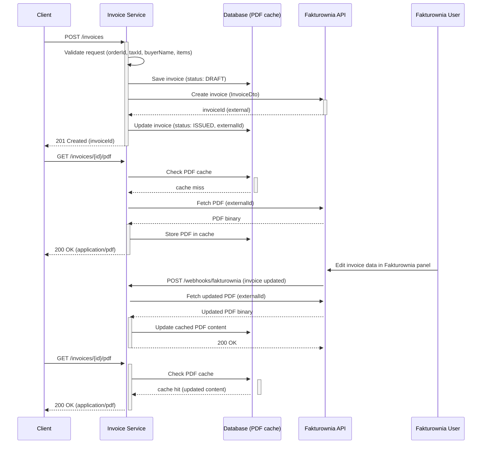

# Invoice Service – Fakturownia Integration Platform

[](https://spring.io/projects/spring-boot)
[](https://openjdk.org/)
[](https://www.docker.com/)
[](https://codecov.io/gh/mrzodeczko-dev/invoice-service)
[](https://opensource.org/licenses/MIT)

<a id="toc"></a>
## Table of Contents

- [Overview](#overview)
- [How It Works](#how-it-works)
- [API Endpoints](#api-endpoints)
- [Getting Started](#getting-started)
- [Environment Variables](#environment-variables)
- [Troubleshooting](#troubleshooting)
- [Architecture](#architecture)
- [Technical Highlights](#technical-highlights)
- [Tech Stack](#tech-stack)
- [Testing](#testing)
- [Observability](#observability)
- [Repository Structure](#repository-structure)
- [Roadmap](#roadmap)
- [Contact](#contact)

---

<a id="overview"></a>
## Overview

[↑ Back to top](#toc)

Invoice Service is a production-ready microservice responsible for invoice lifecycle management, integrated with the [Fakturownia](https://fakturownia.pl) external invoicing API. The service handles invoice generation, PDF retrieval, and incoming webhook processing – all exposed via a clean REST API with built-in Swagger UI documentation.

The project demonstrates modern backend engineering practices: **Hexagonal Architecture (Ports & Adapters)**, Java Virtual Threads (Project Loom), and a fully containerized development environment.

---

<a id="how-it-works"></a>
## How It Works

[↑ Back to top](#toc)

Complete invoice lifecycle from API request to PDF retrieval and cache invalidation via webhooks:



### Step-by-step

1. **Invoice creation (`POST /invoices`)** — the client sends invoice data. The application validates the request and persists a new invoice with `DRAFT` status.
2. **External registration** — the service calls Fakturownia to create the invoice. On success, the local record is updated with the external ID and status changes to `ISSUED`.
3. **PDF retrieval – cache miss (`GET /invoices/{id}/pdf`)** — on cache miss, the service fetches the PDF from Fakturownia, stores it in the database, and returns it to the client.
4. **Invoice edited in Fakturownia panel** — a user edits the invoice directly in the Fakturownia UI. Fakturownia fires a webhook to the service.
5. **Webhook callback (`POST /webhooks/fakturownia`)** — the service fetches the updated PDF from Fakturownia and overwrites the local database cache.
6. **PDF retrieval – cache hit** — subsequent PDF requests are served directly from the database cache. No Fakturownia call needed.
7. **Idempotency guard** — `InvoiceAlreadyExistsException` prevents duplicate invoice creation for the same `orderId`, returning `409 Conflict`.
8. **Concurrency safety** — `InvoiceConcurrentModificationException` guards against race conditions on concurrent invoice state updates.

---

<a id="api-endpoints"></a>
## API Endpoints

[↑ Back to top](#toc)

Base URL (local): `http://localhost:${INVOICE_SERVICE_PORT}` (default: `8082`)

| Method | Path | Description | Request body | Success | Error codes |
|--------|------|-------------|-------------|---------|-------------|
| `GET` | `/` | Service health check | — | `200 OK` | — |
| `POST` | `/invoices` | Create a new invoice | `orderId`, `taxId`, `buyerName`, `items[]` | `201 Created` (`invoiceId`) | `400`, `409`, `500` |
| `GET` | `/invoices/{id}/pdf` | Download invoice PDF | — | `200 OK` (`application/pdf`) | `404`, `500` |
| `POST` | `/webhooks/fakturownia` | Handle Fakturownia webhook | JSON webhook payload | `200 OK` | `400`, `500` |

### cURL examples

**Create invoice:**
```bash
curl -X POST "http://localhost:8082/invoices" \
  -H "Content-Type: application/json" \
  -d '{
    "orderId": "bad9c5b2-73a3-4cb2-96d2-8ae7c29d6297",
    "taxId": "123-456-78-90",
    "buyerName": "John Doe",
    "items": [
      { "name": "Product A", "quantity": 2, "price": 99.99 },
      { "name": "Product B", "quantity": 1, "price": 49.99 }
    ]
  }'
```

**Download invoice PDF:**
```bash
curl -X GET "http://localhost:8082/invoices/3fa85f64-5717-4562-b3fc-2c963f66afa6/pdf" \
  --output invoice.pdf
```

**Health check:**
```bash
curl "http://localhost:8082/"
```

---

<a id="getting-started"></a>
## Getting Started

[↑ Back to top](#toc)

### Prerequisites

- Docker & Docker Compose v2
- Java 25+ _(only if running outside containers)_
- Maven 3.9+ _(only if running outside containers)_

### 1. Environment configuration

```bash
cp .env.example .env
```

Fill in all required variables (Fakturownia credentials, database passwords). See [Environment Variables](#environment-variables) for a full reference.

> `.env` is excluded from version control. `.env.example` serves as a safe schema for collaborators.

### 2. Start the services

```bash
docker compose up -d --build
```

MySQL readiness is health-checked before the application container starts — no manual sequencing needed.

### 3. Verify

| Resource | URL |
|----------|-----|
| Invoice Service API | `http://localhost:${INVOICE_SERVICE_PORT}` |
| Health check | `http://localhost:${INVOICE_SERVICE_PORT}/` |
| Actuator health | `http://localhost:${INVOICE_SERVICE_PORT}/actuator/health` |
| MySQL | `localhost:${INVOICE_SERVICE_MYSQL_DB_PORT}` |

### 4. Swagger UI (optional)

The Swagger UI container is activated via the `docs` Docker Compose profile. It renders a runtime `openapi.yaml` from `openapi.template.yaml` using values from `.env`.

```bash
docker compose --profile docs up -d --build
```

Then open `http://localhost:${SWAGGER_UI_PORT}` to access the interactive API documentation.

---

<a id="environment-variables"></a>
## Environment Variables

[↑ Back to top](#toc)

All variables are read from `.env` (used by Docker Compose). Copy `.env.example` as a starting point.

### MySQL

| Variable | Required | Description | Default / Example |
|----------|----------|-------------|-------------------|
| `INVOICE_SERVICE_MYSQL_DB_HOST` | yes | MySQL container hostname (Docker internal network name) | `invoice-mysql` |
| `INVOICE_SERVICE_MYSQL_DB_PORT` | yes | Host port mapped to MySQL's internal `3306` | `3306` |
| `INVOICE_SERVICE_MYSQL_DB_NAME` | yes | Database/schema name created on startup | `invoices_db` |
| `INVOICE_SERVICE_MYSQL_DB_USER` | yes | Application database user (non-root) | — |
| `INVOICE_SERVICE_MYSQL_DB_PASSWORD` | yes | Password for the application user | — |
| `INVOICE_SERVICE_MYSQL_DB_ROOT_PASSWORD` | yes | MySQL root password used during container init | — |
| `INVOICE_SERVICE_MYSQL_INNODB_BUFFER_POOL_SIZE` | no | InnoDB buffer pool size | `256M` |
| `INVOICE_SERVICE_MYSQL_MAX_CONNECTIONS` | no | Maximum concurrent MySQL connections | `200` |

### Application

| Variable | Required | Description | Default / Example |
|----------|----------|-------------|-------------------|
| `INVOICE_SERVICE_PORT` | yes | HTTP port exposed by the service container | `8082` |
| `INVOICE_SERVICE_APPLICATION_NAME` | no | `spring.application.name` (used in logs/metadata) | `invoice-service` |
| `INVOICE_SERVICE_FAKTUROWNIA_URL` | yes | Base URL of your Fakturownia account | `https://yourcompany.fakturownia.pl` |
| `INVOICE_SERVICE_FAKTUROWNIA_TOKEN` | yes | API token for Fakturownia authentication | — |
| `SWAGGER_UI_PORT` | no | Host port for the Swagger UI container (`--profile docs`) | `9000` |

> **Where to find `INVOICE_SERVICE_FAKTUROWNIA_TOKEN`:** in your Fakturownia account under _Settings → Integrations → API_. If this value is wrong or missing, all outbound Fakturownia calls will fail with `401 Unauthorized`.

---

<a id="troubleshooting"></a>
## Troubleshooting

[↑ Back to top](#toc)

| Problem | Likely cause | Fix |
|---------|-------------|-----|
| Containers won't start | Port conflict, stale images, invalid `.env` | `docker compose down && docker compose up -d --build`; change ports in `.env` if needed |
| DB connection errors at startup | MySQL still booting, wrong credentials | Check `INVOICE_SERVICE_MYSQL_DB_HOST` matches service name `invoice-mysql`; inspect logs with `docker compose logs invoice-mysql --tail 50` |
| Fakturownia `401 Unauthorized` | Invalid or expired token / wrong URL | Re-check `INVOICE_SERVICE_FAKTUROWNIA_TOKEN` and `INVOICE_SERVICE_FAKTUROWNIA_URL` in `.env`, then restart |
| PDF returns `500` or empty body | Invoice not yet `ISSUED` in Fakturownia | Confirm `POST /invoices` succeeded before fetching PDF; check app logs |

---

<a id="architecture"></a>
## Architecture

[↑ Back to top](#toc)

The service follows **Hexagonal Architecture (Ports & Adapters)**, strictly separating domain logic from infrastructure concerns. All external dependencies (MySQL persistence, Fakturownia API) are injected through explicit output ports, making the core fully testable without any infrastructure.


---

<a id="technical-highlights"></a>
## Technical Highlights

[↑ Back to top](#toc)

- **Hexagonal Architecture** — domain model fully isolated from infrastructure; all external dependencies injected through explicit ports (`TaxSystemPort`, `InvoiceRepository`).
- **Java Virtual Threads (Project Loom)** — `spring.threads.virtual.enabled: true`; cheap virtual threads per request maximise I/O throughput without reactive complexity.
- **Optimistic Concurrency Control** — domain-level guard against concurrent invoice state updates.
- **Webhook-driven cache sync** — on each Fakturownia callback the service fetches the updated PDF and overwrites the local DB cache, no polling needed.
- **Multi-stage Docker build** — minimal JRE runtime image, non-root user, container-aware JVM flags (`UseContainerSupport`, `MaxRAMPercentage=75.0`, G1GC).
- **HikariCP tuning** — `max-pool-size: 20`, `connection-timeout: 2s`, `max-lifetime: 30min`.
- **Liquibase** — versioned database schema migrations.

---

<a id="tech-stack"></a>
## Tech Stack

[↑ Back to top](#toc)

| Layer | Technology |
|-------|------------|
| Language | Java 25 (Virtual Threads enabled) |
| Framework | Spring Boot 4.0.5, Spring Data JPA, Spring WebMVC, Spring Validation |
| Database migrations | Liquibase |
| Database | MySQL 9.6.0 (HikariCP connection pool) |
| External API | Fakturownia (via Spring RestClient) |
| Architecture | Hexagonal / Ports & Adapters |
| Observability | Spring Boot Actuator |
| API docs | Swagger UI (Docker, `docs` profile) |
| Containerization | Docker (multi-stage build), Docker Compose |
| Other | Lombok |

---

<a id="testing"></a>
## Testing

[↑ Back to top](#toc)

The project uses Spring Boot's dedicated test slice starters to keep each test layer isolated:

| Starter | What it tests |
|---------|---------------|
| `spring-boot-starter-data-jpa-test` | JPA slice tests — entity mappings and repository behavior |
| `spring-boot-starter-webmvc-test` | MockMVC controller tests — request validation and error response contracts |
| `spring-boot-starter-restclient-test` | Mocked RestClient tests for the Fakturownia adapter |
| `spring-boot-starter-actuator-test` | Actuator endpoint availability |

```bash
mvn test
```

---

<a id="observability"></a>
## Observability

[↑ Back to top](#toc)

| Endpoint | Description |
|----------|-------------|
| `GET /actuator/health` | Spring Boot Actuator health — used by Docker healthcheck and orchestrators |
| `GET /` | Application-level health check controller |

JVM is tuned for container environments: `-XX:+UseContainerSupport`, `-XX:MaxRAMPercentage=75.0`, G1GC.

---

<a id="repository-structure"></a>
## Repository Structure

[↑ Back to top](#toc)

```
.
├── src/
│   ├── main/
│   │   ├── java/com/rzodeczko/
│   │   │   ├── application/
│   │   │   │   ├── port/
│   │   │   │   │   ├── input/          # Inbound ports (use case interfaces + commands)
│   │   │   │   │   └── output/         # Outbound ports (TaxSystemPort, InvoiceRepository)
│   │   │   │   └── service/            # Application service (InvoiceService)
│   │   │   ├── domain/
│   │   │   │   ├── exception/          # Domain exceptions
│   │   │   │   ├── model/              # Domain models (Invoice, InvoiceItem, InvoiceStatus)
│   │   │   │   └── repository/         # Repository interface (InvoiceRepository)
│   │   │   ├── infrastructure/
│   │   │   │   ├── configuration/      # Spring beans, Fakturownia & Swagger CORS properties
│   │   │   │   ├── fakturownia/        # FakturowniaAdapter + DTOs (RestClient integration)
│   │   │   │   ├── persistence/        # JPA entities, mapper, repository adapter
│   │   │   │   └── transaction/        # Transaction boundary
│   │   │   ├── usecase/                # Use case implementations
│   │   │   └── presentation/
│   │   │       ├── controller/         # REST controllers (Invoice, Webhook, HealthCheck)
│   │   │       ├── dto/                # Request/Response DTOs
│   │   │       └── exception/          # Global exception handler
│   │   └── resources/
│   │       └── application.yaml        # Server, datasource, HikariCP, virtual threads config
│   └── test/                           # JPA & controller slice tests
├── docker-compose.yaml                 # MySQL + application + Swagger UI orchestration
├── Dockerfile                          # Multi-stage build (Maven → minimal JRE runtime)
├── openapi.template.yaml               # OpenAPI spec template (injected into Swagger UI container)
├── .env.example                        # Environment variables template
└── pom.xml
```

---

<a id="roadmap"></a>
## Roadmap

[↑ Back to top](#toc)

- **Testcontainers** — ephemeral MySQL instances in integration tests, fully isolated and reproducible without external DB dependencies.
- **Resilience4j** — Retry + Circuit Breaker on Fakturownia RestClient calls to handle transient API unavailability gracefully.
- **CI/CD Pipeline** — GitHub Actions workflow automating build → test → Docker image push with JaCoCo coverage gate.
- **Distributed Tracing** — OpenTelemetry integration with Tempo/Jaeger for end-to-end request visibility.

---

<a id="contact"></a>
## Contact

[↑ Back to top](#toc)

Designed and implemented by **Michał Rzodeczko**.  
Other projects: [github.com/mrzodeczko-dev](https://github.com/mrzodeczko-dev)
